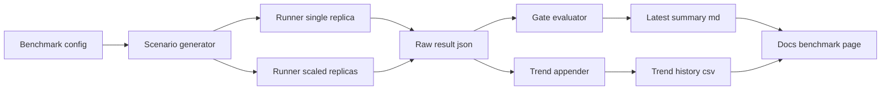

# Robust Benchmark Testing Plan for Documentation

## Goal

Create a reproducible, fair, and transparent benchmark program that:

- keeps existing release safety gates for Krab internal SLOs
- adds external comparison results for documentation context
- publishes methodology and artifacts so results can be independently reproduced

## Benchmark Scope v1

### Frameworks

- Krab
- Next.js
- Nuxt
- SvelteKit
- Remix
- Leptos
- Dioxus

### Route matrix

All frameworks should implement equivalent routes and behaviors:

1. **SSR Static Page**: home route equivalent to `/`
2. **SSR Dynamic Route**: route parameter equivalent to `/blog/{slug}`
3. **JSON API Read**: status endpoint equivalent to `/api/status`
4. **JSON API Mutation**: POST endpoint equivalent to `/api/contact`
5. **Health Route**: lightweight endpoint equivalent to `/health`

### Workload profiles

Use three profiles per route:

- **load** steady traffic
- **spike** short burst traffic
- **soak** sustained duration traffic

## Fairness and Parity Rules

1. Same host class and OS image for all framework runs.
2. Same CPU and memory limits per container.
3. Same database/cache backing service settings when used.
4. Keep TLS termination and reverse proxy path identical across frameworks.
5. Disable framework-specific debug tooling for benchmark runs.
6. Pin dependency versions and lockfiles for repeatability.
7. Use equivalent payload sizes and response shapes across frameworks.
8. Publish config deltas and known non-equivalences in artifact notes.

## Harness Architecture

Leverage current Krab scripts and extend with a framework-aware harness.

## Statistical Methodology

1. Warmup phase before measured samples.
2. Minimum run count per route and profile with independent repetitions.
3. Report p50, p95, p99, max, mean, stddev, and error rate.
4. Use median of repeated runs for headline comparison values.
5. Store raw sample counts and run seed metadata in JSON artifacts.
6. Flag high variance runs and annotate as unstable.
7. Keep baseline windows for regression checks on Krab internal gates.

## Artifact and Schema Extensions

Extend current artifacts under [`load_test_artifacts`](load_test_artifacts):

- add `external_summary.md` for docs-facing comparison tables
- add `external_results.json` with per-framework per-route per-profile metrics
- add `methodology_snapshot.md` generated from run configuration
- extend `trend_history.csv` with `framework` and `route` columns for external trending

Keep existing release-gate artifacts intact:

- [`thresholds.json`](load_test_artifacts/thresholds.json)
- [`trend_history.csv`](load_test_artifacts/trend_history.csv)
- [`latest_summary.md`](load_test_artifacts/latest_summary.md)

## CI Gate Policy

### Release-blocking

Only Krab internal service gates remain blocking in CI:

- existing threshold and scaling checks from [`scripts/nft_multi_service_gate.py`](../scripts/nft_multi_service_gate.py)
- scaling regression checks from [`scripts/nft_scaling_compare.py`](../scripts/nft_scaling_compare.py)
- trend append workflow from [`scripts/nft_append_trends.py`](../scripts/nft_append_trends.py)

### Non-blocking but published

External framework comparisons are informational for docs:

- do not fail release pipeline by default
- can fail a dedicated nightly benchmark job
- always publish artifacts and environment metadata

## Documentation Deliverables

1. New benchmark methodology page in docs wiki.
2. Benchmark results page with comparison tables and caveats.
3. Reproducibility section with exact run commands and environment spec.
4. Interpretation guide explaining what the numbers do and do not mean.

## Execution Plan for Code Mode

1. Create benchmark config schema with framework and route matrix.
2. Refactor runner to support framework targets and route groups.
3. Add raw artifact writer for external per-route metrics JSON.
4. Add external markdown summary generator.
5. Extend trend appender to optional external rows.
6. Keep internal CI gates unchanged for blocking decisions.
7. Add nightly workflow job for full external comparison matrix.
8. Add docs pages and link from wiki home and frontend service docs.
9. Add validation script that checks artifact completeness before publish.
10. Document known benchmark caveats and parity exceptions per framework.

## Success Criteria

- reproducible benchmark reruns on same commit produce comparable ranges
- internal Krab SLO gate remains strict and deterministic
- external comparison artifacts are transparent and easy to audit
- docs show methodology before charts and clearly label informational results
